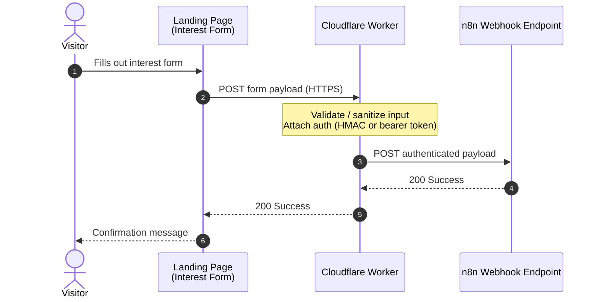

# WordPress Plugin - Songfacts API Interest Form

This is a WordPress plugin that will be installed on `helpers.savage.ventures` wordpress site in order to receive relayed payloads of data from the Songfacts API landing page. 

## Overview

> As of Aug 7 2026, the songfacts API landing page sends payloads to a CF worker, and the CF worker sends the authenticated payloads to an n8n webhook endpoint. 

**Mermaid Diagram**



---

# Milestone 1 - WordPress Destination

Implemented as the plugin in [`songfacts-api-landingpage/`](songfacts-api-landingpage), plugin
name **Songfacts API Landing Page** (slug `songfacts-api-landingpage`).

## Create WordPress REST API Endpoint

`POST /wp-json/songfacts-crm/v1/submissions` — receives the payload n8n forwards after the CF
Worker authenticates it. Body fields (matching the shape `script.js` sends today): `firstName`,
`lastName`, `email`, `company`, `message`, `submittedAt`. Any `turnstileToken` field, if present,
is discarded rather than stored.

**Auth:** the request must carry `Authorization: Bearer <token>`, where `<token>` is an HS256 JWT
signed with the *same* `JWT_SIGNING_SECRET` the Cloudflare Worker already uses to authenticate to
n8n (see the Worker's own project). In other words, n8n's workflow needs to forward that same
JWT/header through to this endpoint (unexpired) rather than minting new credentials — chosen
specifically so Milestone 2 (Worker → WordPress directly) needs no auth changes on the WordPress
side, only a different caller.

Enter the shared secret at **wp-admin → Songfacts API CRM → Settings**. It must exactly match the
Worker's `JWT_SIGNING_SECRET`.

Quick manual test (replace `$JWT` with a token signed using the shared secret):

```bash
curl -i -X POST https://helpers.savage.ventures/wp-json/songfacts-crm/v1/submissions \
  -H "Authorization: Bearer $JWT" \
  -H "Content-Type: application/json" \
  -d '{"firstName":"Ada","lastName":"Lovelace","email":"ada@example.com","company":"Analytical Engines","message":"Interested in the API.","submittedAt":"2026-08-07T12:00:00Z"}'
```

Expect `201` with `{"id":<n>,"status":"received"}` on success, `401` if the bearer token is
missing/invalid/expired, `400` on a malformed payload.

## Render on the WP-Admin
1. Topmost admin menu `Songfacts API CRM` (dashicons-media-audio) ✅
2. Submenu `Submissions` ✅ — lists received payloads in a standard `WP_List_Table`; clicking a
   row expands its detail (message, received/completed timestamps) in place, no navigation.
3. Inline **Mark as Completed** button per row — AJAX call to `wp_ajax_sf_lp_mark_completed`,
   updates the row's status badge without a page reload.
4. Submenu `Settings` (not in the original spec, added because the JWT secret needs somewhere to
   live) — holds the shared JWT secret described above, plus two testing buttons:
   - **Populate Sample Submissions** — inserts ten fake, clearly-flagged (`is_sample = 1`) rows
     spread over the past several days (a mix of `new`/`completed` status) so the Submissions
     list and admin UI can be exercised before real traffic exists.
   - **Delete Sample Submissions** — removes every `is_sample = 1` row. Never touches real
     submissions from the REST endpoint, which always insert with `is_sample = 0`.

### Install

Zip the `songfacts-api-landingpage/` folder (or copy it as-is into `wp-content/plugins/`) on
`helpers.savage.ventures`, then activate **Songfacts API Landing Page** from Plugins. Activation
creates the `{$wpdb->prefix}sflp_submissions` table via `dbDelta`; deleting the plugin (not just
deactivating) drops that table and the stored secret.

---

# Milestone 2 - Update the CF Worker

Upon milestone 1 completedion - then re-route the CF Worker to write directly to WordPress instead of n8n. 
