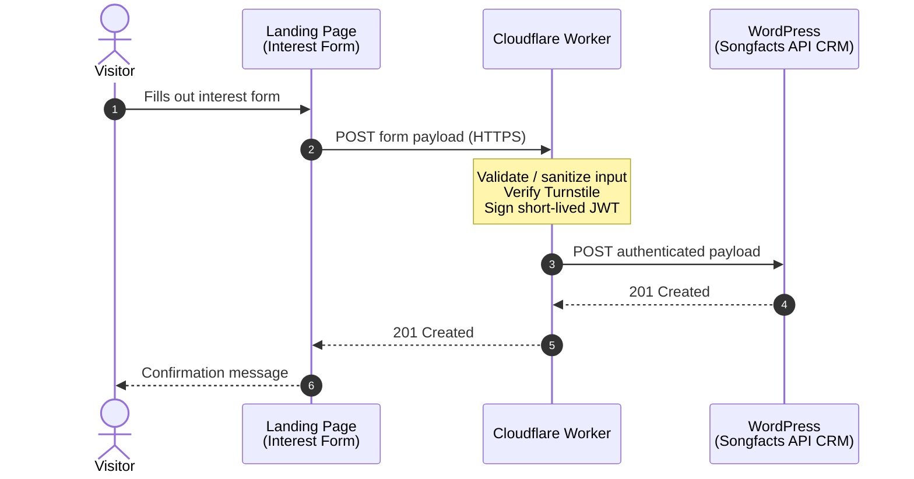

# WordPress Plugin - Songfacts API Interest Form

This is a WordPress plugin that will be installed on `helpers.savage.ventures` wordpress site in order to receive relayed payloads of data from the Songfacts API landing page. 

## Overview

> As of Aug 7 2026, the Songfacts API landing page sends payloads to a CF Worker, and the Worker
> posts the authenticated payload directly to this WordPress plugin's REST endpoint. (Originally
> the Worker relayed through an n8n webhook — that hop was removed in Milestone 2, verified via a
> real end-to-end form submission the same day. n8n's webhook workflow can be decommissioned.)

**Mermaid Diagram**



---

# Milestone 1 - WordPress Destination

Implemented as the plugin in [`songfacts-api-landingpage/`](songfacts-api-landingpage), plugin
name **Songfacts API Landing Page** (slug `songfacts-api-landingpage`).

## Create WordPress REST API Endpoint

`POST /wp-json/songfacts-crm/v1/submissions` — receives the payload posted directly by the CF
Worker (see Milestone 2; originally this went through an n8n webhook, which forwarded the same
JWT-bearing request on to here). Body fields (matching the shape `script.js` sends today):
`firstName`, `lastName`, `email`, `company`, `message`, `submittedAt`. Any `turnstileToken` field,
if present, is discarded rather than stored.

**Auth:** the request must carry `Authorization: Bearer <token>`, where `<token>` is an HS256 JWT
signed with the *same* `JWT_SIGNING_SECRET` the Cloudflare Worker signs with (see the Worker's own
project). This endpoint's auth was deliberately built to verify that exact JWT from day one —
which is why Milestone 2 (routing the Worker straight here instead of through n8n) needed no
WordPress-side auth changes, only a different caller.

Enter the shared secret at **wp-admin → Songfacts API CRM → Settings**. It must exactly match the
Worker's `JWT_SIGNING_SECRET` byte-for-byte — a mismatch here is exactly what caused the first
Milestone 2 end-to-end test to fail with a `401` (see Milestone 2 below).

Quick manual test (replace `$JWT` with a token signed using the shared secret):

```bash
curl -i -X POST https://helpers.savage.ventures/wp-json/songfacts-crm/v1/submissions \
  -H "Authorization: Bearer $JWT" \
  -H "Content-Type: application/json" \
  -d '{"firstName":"Ada","lastName":"Lovelace","email":"ada@example.com","company":"Analytical Engines","message":"Interested in the API.","submittedAt":"2026-08-07T12:00:00Z"}'
```

Expect `201` with `{"id":<n>,"status":"received"}` on success, `401` if the bearer token is
missing/invalid/expired, `400` on a malformed payload.

## Render on the WP-Admin
1. Topmost admin menu `Songfacts API CRM` (dashicons-media-audio) ✅
2. Submenu `Submissions` ✅ — lists received payloads in a standard `WP_List_Table`; clicking a
   row expands its detail (message, received/completed timestamps) in place, no navigation.
3. Inline **Mark as Completed** button per row — AJAX call to `wp_ajax_sf_lp_mark_completed`,
   updates the row's status badge without a page reload.
4. Submenu `Settings` (not in the original spec, added because the JWT secret needs somewhere to
   live) — holds the shared JWT secret described above, plus two testing buttons:
   - **Populate Sample Submissions** — inserts ten fake, clearly-flagged (`is_sample = 1`) rows
     spread over the past several days (a mix of `new`/`completed` status) so the Submissions
     list and admin UI can be exercised before real traffic exists.
   - **Delete Sample Submissions** — removes every `is_sample = 1` row. Never touches real
     submissions from the REST endpoint, which always insert with `is_sample = 0`.

### Install

Zip the `songfacts-api-landingpage/` folder (or copy it as-is into `wp-content/plugins/`) on
`helpers.savage.ventures`, then activate **Songfacts API Landing Page** from Plugins. Activation
creates the `{$wpdb->prefix}sflp_submissions` table via `dbDelta`; deleting the plugin (not just
deactivating) drops that table and the stored secret.

### Deploying changes / cache gotcha

This site isn't wired to any CI — updated plugin files are pushed to
`helpers.savage.ventures` manually (WP File Manager / direct file copy), then activated/reloaded
by hand. **Whenever `admin/js/admin.js` or `admin/css/admin.css` changes, bump `SF_LP_VERSION`**
in `songfacts-api-landingpage.php` — it's the cache-busting query string
(`admin.js?ver=<version>`) WordPress appends via `wp_enqueue_script()`/`wp_enqueue_style()`. Skip
the bump and browsers that already visited the Settings/Submissions page keep serving the old
cached file from that exact versioned URL even after the new file is live on the server — this bit
us during development (worked in a fresh browser profile, silently failed in an everyday Chrome
profile with cached assets) and cost real debugging time. See
[`songfacts-api-landingpage/CLAUDE.md`](songfacts-api-landingpage/CLAUDE.md) for more on this and
other gotchas discovered while building the plugin.

---

# Milestone 2 - Update the CF Worker

Upon milestone 1 completedion - then re-route the CF Worker to write directly to WordPress instead of n8n.

- [x]  RE-ROUTE The CF Worker to WordPress instead of to n8n — code change made, deployed, and
       verified end-to-end (real form submission through Turnstile, landed in wp-admin →
       Songfacts API CRM → Submissions) on 2026-08-07. **Milestone 2 complete.**

The Worker's own project lives outside this repo at
`~/WebstormProjects/songfacts-api-interest-submission` (see root `CLAUDE.md`). `src/index.ts` now
posts directly to `https://helpers.savage.ventures/wp-json/songfacts-crm/v1/submissions` instead
of `env.N8N_WEBHOOK_URL` — everything upstream of that (CORS, rate limiting, payload validation,
Turnstile verification, JWT signing) is unchanged, since Milestone 1's WordPress auth was
deliberately built to verify the exact same JWT the Worker already signs. `N8N_WEBHOOK_URL` was
dropped from the `Env` interface since it's a plain public REST URL, not a secret — no new
`wrangler secret put` needed.

**Debugging note for next time:** the first end-to-end attempt failed with a `401` — reproduced by
tailing the live Worker (`wrangler tail songfacts-api-interest-submission --format json`), which
showed the WP-bound `POST` itself returning `401` (the Worker has no 401 of its own, so this was
WordPress's `SF_LP_JWT::verify()` rejecting the token — a straight pass-through of `upstream.status`).
Root cause was the Worker's `JWT_SIGNING_SECRET` and WordPress's `sf_lp_jwt_secret` option having
drifted out of sync after the secret was rotated earlier that day. Fixed by re-running
`wrangler secret put JWT_SIGNING_SECRET` (from inside the Worker's project directory, or with
`--name songfacts-api-interest-submission` from elsewhere) with the value that matches the WP
Settings field exactly, then retrying. If a `401` shows up again after any future secret rotation,
check this pairing first.

**Cleanup, now safe to do:**
- `N8N_WEBHOOK_URL` secret is unused on the Worker; remove with
  `wrangler secret delete N8N_WEBHOOK_URL --name songfacts-api-interest-submission` (harmless to
  leave in place if you'd rather not bother).
- n8n's webhook workflow for this integration can be decommissioned/disabled.
