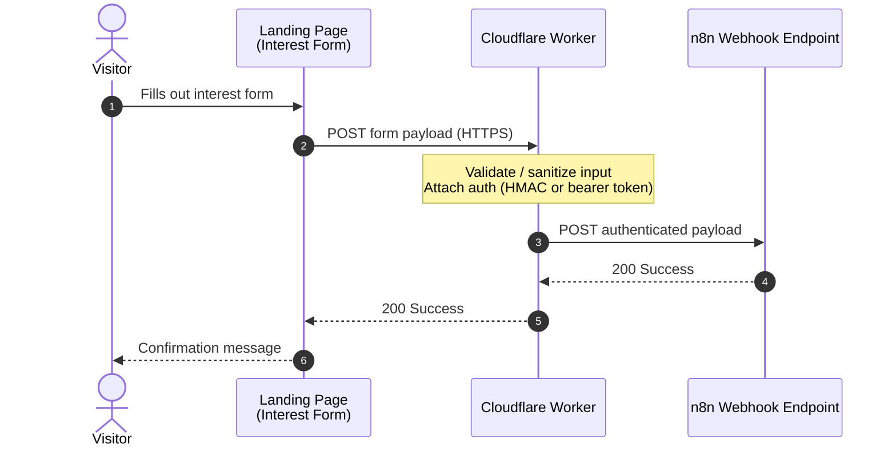

# WordPress Plugin - Songfacts API Interest Form

This is a WordPress plugin that will be installed on `helpers.savage.ventures` wordpress site in order to receive relayed payloads of data from the Songfacts API landing page. 

## Overview

> As of Aug 7 2026, the songfacts API landing page sends payloads to a CF worker, and the CF worker sends the authenticated payloads to an n8n webhook endpoint. 

**Mermaid Diagram**

---

# [WIP] Milestone 1 - WordPress Destination

## Create WordPress REST API Endpoint

First, we must create a way for WordPress to receive these payloads from n8n (and eventually directly from the CF worker).

## Render on the WP-Admin
1. Add a topmost admin menu named `Songfacts API CRM` dashicons-media-audio
2. Register first submenu named `Submissions`
3. Render a list of the received payloads of data from the website interest form. Show this in a wordpress admin side list style, and upon a row being clicked, just expand in place the details of the submission
4. Add an inline "Mark as Completed" to record here in place in wp, the fact that a submission has been responded to by administrators. 

---

# Milestone 2 - Update the CF Worker

Upon milestone 1 completedion - then re-route the CF Worker to write directly to WordPress instead of n8n. 
